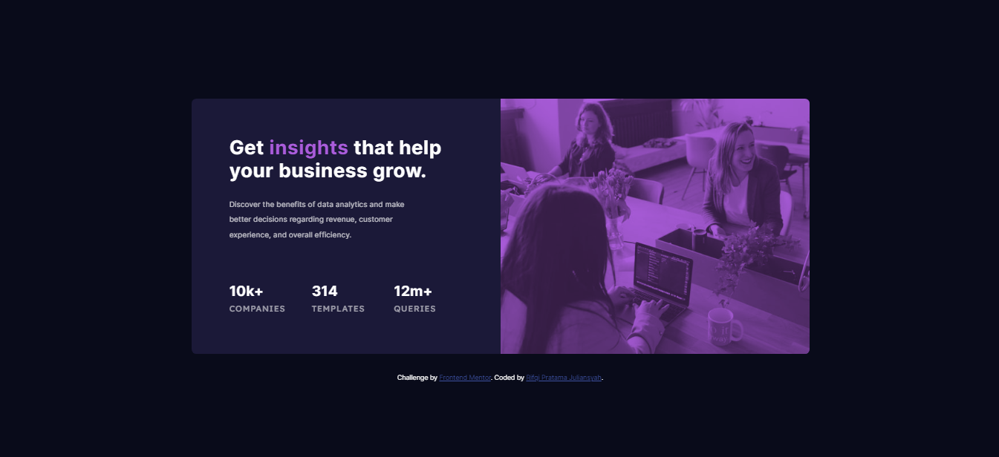

# Frontend Mentor - Stats preview card component solution

This is a solution to the [Stats preview card component challenge on Frontend Mentor](https://www.frontendmentor.io/challenges/stats-preview-card-component-8JqbgoU62). Frontend Mentor challenges help you improve your coding skills by building realistic projects. 

## Table of contents

- [Overview](#overview)
  - [The challenge](#the-challenge)
  - [Screenshot](#screenshot)
  - [Links](#links)
- [My process](#my-process)
  - [Built with](#built-with)
  - [What I learned](#what-i-learned)
  - [Useful resources](#useful-resources)
- [Author](#author)

**Note: Delete this note and update the table of contents based on what sections you keep.**

## Overview

### The challenge

Users should be able to:

- View the optimal layout depending on their device's screen size

### Screenshot

### Links

- Solution URL: [Solution URL (Frontendmentor)](https://www.frontendmentor.io/solutions/stats-preview-card-component-0ZW3RvvHPQ)
- Live Site URL: [Live Site URL](https://stats-preview-frontendmentor.vercel.app/)

## My process

### Built with

- Semantic HTML5 markup
- CSS custom properties
- Flexbox
- CSS Grid
- Mobile-first workflow
- SCSS

### What I learned

Learn CSS Reset by Josh Comeau, Learn using mix-blend-mode and learn using SCSS/SASS

### Useful resources

- [CSS Reset By Josh Comeau](https://www.joshwcomeau.com/css/custom-css-reset/) - This helped me for resetting CSS
- [Mix-Blend-Mode CSS](https://developer.mozilla.org/en-US/docs/Web/CSS/mix-blend-mode?retiredLocale=id) - This is an amazing documentation which helped me to using mix-blend-mode for picture/img.

## Author

- Website - [Rifqi Pratama Juliansyah](https://www.rifqipratamaj.me/)
- Frontend Mentor - [@juliansyahrifqi](https://www.frontendmentor.io/profile/juliansyahrifqi)
- Twitter - [@juliansyahrifq1](https://www.twitter.com/juliansyahrifq1)

